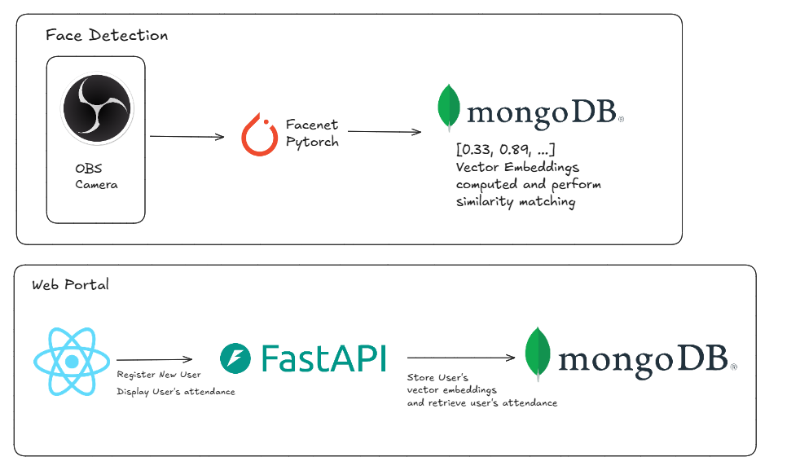

## Face Recognition Attendance Tracker
This project involves a face recognition attendance system that detect and recognize faces in real time. It utilizes [Pytorch FaceNet](https://github.com/timesler/facenet-pytorch) Model (MTCNN & Inception Resnet) to extract facial embeddings, which are then matched against stored embeddings using cosine similarity via MongoDB’s vector search to identify the most similar face in the database. The users attendance is then marked as present in the database.

### Architecture Diagram

<div align="center">
    
</div>

### To run the project
### Backend
```bash
> python -m venv venv
> source venv/bin/activate  # or venv\Scripts\activate on Windows
> cd backend
> pip install -r requirements.txt
> fastapi dev backend.py
```

### Frontend
```bash
> cd frontend
> npm install
> npm run dev
```

### Contributers
- Chong Wei Jie
- Melody Koh